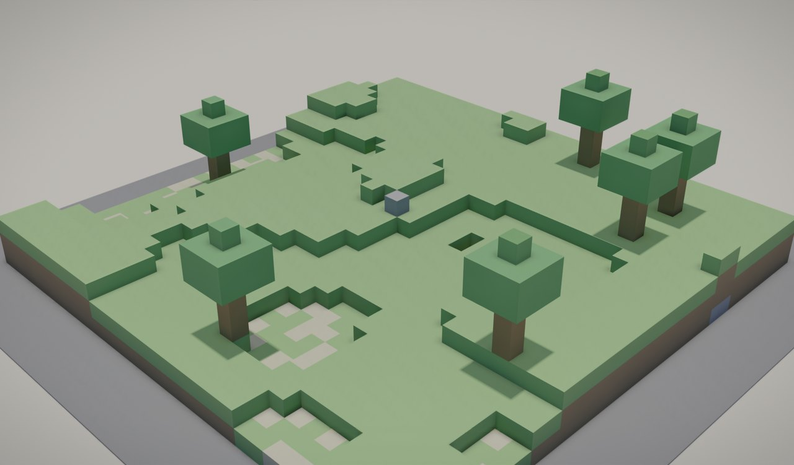

# Blockworld — a Minecraft-style block world for agents

A 32 × 32 field of one-metre cubes — 2,666 blocks of grass, dirt, stone and ore, six trees, one red probe ball — where **every block is its own static Solid named by grid coordinate**. There is no player controller and no keyboard: the agent is the player, and it mines and builds over the [validation harness](../../scripts/harness/README.md). Load it, read the scene, break a block, place a block, watch physics answer, take a picture.



| | |
|---|---|
| World | [`projects/samples/demos/worlds/environments/blockworld.omniworld`](../../projects/samples/demos/worlds/environments/blockworld.omniworld) — generated; edit the generator, not the file |
| Generator | [`gen_blockworld.py`](../../projects/samples/demos/worlds/environments/gen_blockworld.py) — `--seed`, `--size`, `--max-height`, `--trees`; same inputs → byte-identical output |
| Load check | `python -m omnisim run-headless projects/samples/demos/worlds/environments/blockworld.omniworld --until-finalized --fail-on-warning` |
| Physics check | `python -m omnisim run-headless projects/samples/demos/worlds/environments/blockworld.omniworld --duration 10 --fail-on-runaway` |
| Catalogue | [DEMOS.md → Blockworld](../../DEMOS.md#blockworld--a-minecraft-style-block-world-for-agents) |

## Why this exists now

Until 2026-09-07 a world like this had no physics at all. Every static Solid was its own MuJoCo body, MuJoCo's broadphase sizes a buffer with the square of the body count, and 2,000 blocks overflowed it while 5,000 never finalised. Plain static colliders now share Newton's world body, so thousands of blocks load and finalise in seconds — the full story, with the measurements, is in [agents-hard-won-rules.md → World-body statics](../developer/agents-hard-won-rules.md#world-body-statics). This world is the demo of that change, and a small agent environment in its own right.

## The block grid

Block `(x, y, z)` occupies `[x, x+1) × [y, y+1) × [z, z+1)` metres, so its Solid sits at `(x+0.5, y+0.5, z+0.5)`. It is `DEF B_x_y_z` with `name "b_x_y_z"`, a 1 m `Box` visual coloured by kind, and a 1 m `Box` boundingObject. Columns are 1–4 blocks tall from seeded value noise; the top block is grass (or sand on the lowest columns), the next two dirt, anything below stone with an occasional ore. Trees are a four-log trunk with a 3 × 3 × 2 leaf crown and a cap. Buried blocks keep their colliders on purpose: a rebuild after an edit re-registers the scene as it is, so a freshly exposed block is solid with no bookkeeping on the agent's side.

The probe is `DEF PROBE`, a 0.3 m dynamic sphere dropped onto the middle column. It is the one body that moves, and it is listed first in the file so the runaway watchdog tracks it.

## The agent loop

Start the harness and load the world in light mode (the trackers are not needed here and cost step time):

```bash
python -m omnisim harness --port 6789
curl -s -X POST http://127.0.0.1:6789/world/load -H "Content-Type: application/json" \
  -d '{"path":"projects/samples/demos/worlds/environments/blockworld.omniworld","light":true}'
```

Read the scene. Every block answers by DEF; the fields tell you where it is and that it collides:

```bash
curl -s http://127.0.0.1:6789/scene/node/B_16_16_2      # translation [16.5, 16.5, 2.5], boundingObject present
curl -s http://127.0.0.1:6789/sim/contacts               # [{"a_def": "PROBE", "b_def": "B_16_16_2", ...}]
```

**Break a block.** Delete it and ask for the physics rebuild in the same call — without `physics: rebuild` the block vanishes from the picture but stays solid ([PROTOCOL.md §7.30](../../PROTOCOL.md#730-post-scenedelete), [§7.36](../../PROTOCOL.md#736-post-simrebuild_physics)):

```bash
curl -s -X POST http://127.0.0.1:6789/scene/delete -H "Content-Type: application/json" \
  -d '{"def":"B_16_16_2","physics":"rebuild"}'
curl -s -X POST http://127.0.0.1:6789/sim/step -H "Content-Type: application/json" -d '{"steps":150}'
curl -s http://127.0.0.1:6789/scene/node/PROBE           # the ball fell one block: z 3.30 -> 2.30
curl -s http://127.0.0.1:6789/sim/contacts               # now PROBE vs B_16_16_1
```

**Place a block.** Spawn the same VRML the generator writes, at the grid position, with the rebuild ([§7.29](../../PROTOCOL.md#729-post-scenespawn)):

```bash
curl -s -X POST http://127.0.0.1:6789/scene/spawn -H "Content-Type: application/json" -d '{
  "vrml": "Solid { name \"b_16_16_3\" children [ Shape { appearance PBRAppearance { baseColor 0.5 0.5 0.52 roughness 1 metalness 0 } geometry Box { size 1 1 1 } } ] boundingObject Box { size 1 1 1 } }",
  "def": "B_16_16_3", "translation": [16.5, 16.5, 3.5], "physics": "rebuild"}'
```

**Look.** `POST /world/screenshot` gives the picture above from the authored Viewpoint; `POST /scene/frame {"def": "PROBE"}` aims at the ball and reports what it framed; `GET /scene/visible` tells you what is in the frustum before you spend a screenshot.

**Batch.** Several edits, then one rebuild, is the cheap way to build anything larger than a block: send the deletes and spawns without `physics`, then `POST /sim/rebuild_physics` once.

**Reset.** `POST /sim/reset` rewinds the clock and restores the authored scene — every block back, the probe at its drop height.

## What it costs

Measured 2026-09-07 through the harness on this world, CPU `mj_step`, machine `9722d23d12a3`:

| Call | Measured |
|---|---|
| `POST /world/load` (light) | 10.7 s, 5,343 scene nodes, 2,667 statics on the world body |
| `POST /sim/step {"steps": 120}` | 148 ms wall (1.2 ms per step) |
| `POST /scene/delete` + rebuild | 4.6 s round trip |
| `POST /scene/spawn` + rebuild | 4.8 s round trip |
| Headless load check (`--until-finalized`) | finalised 7.7 s after launch |

The rebuild is the whole physics build again — registration plus finalise, dominated by newton's own MuJoCo conversion — so it scales with the block count: about a second at 500 blocks, under five at 2,666, and [about 130 s at 20,000](../developer/agents-hard-won-rules.md#world-body-statics). An agent does not mind a five-second edit; a human at a keyboard would, which is why this is an agent environment and not a game.

## What is deliberately not here

- **No player robot.** A Husky cannot climb one-metre steps and a humanoid would need a policy; the agent acts through the harness instead. Drop a robot in if you want one — the world is an ordinary `.omniworld`.
- **No inventory, crafting or mobs.** Block kinds are colours; the generator's `PALETTE` is the whole material system. Mobs are robots with controllers, and none is authored yet.
- **No runtime lighting changes.** OmniLight GI is a static bake; the sun is a node a supervisor can move, but nothing does.

## Regenerating

```bash
python projects/samples/demos/worlds/environments/gen_blockworld.py                 # rewrites blockworld.omniworld
python projects/samples/demos/worlds/environments/gen_blockworld.py --seed 7 --size 48 --max-height 6 --out big.omniworld
```

Larger fields are fine to load — the engine side is linear in the block count — but every edit rebuilds physics, so keep an agent's working world in the low thousands unless it edits rarely.
